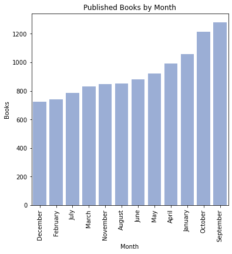
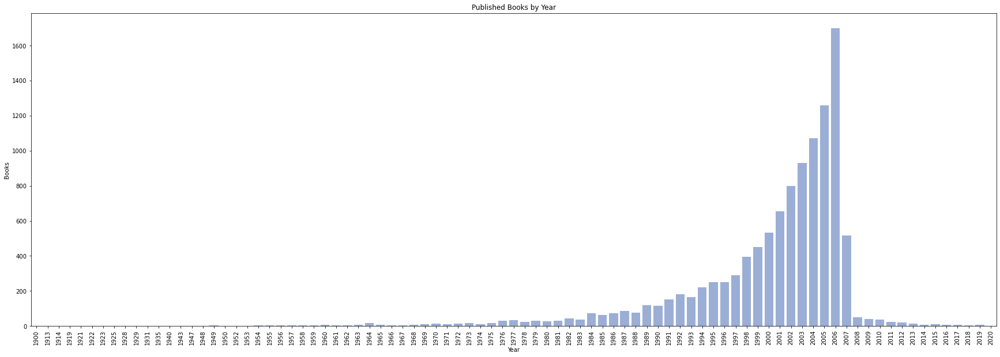
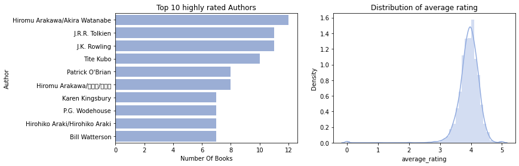
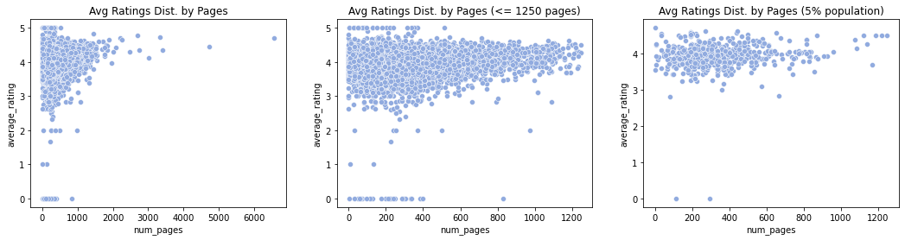
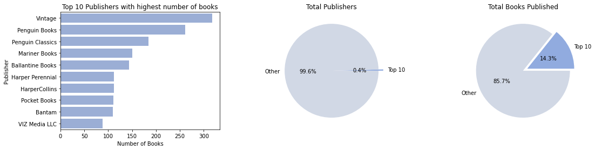

# Goodreads Dataset EDA

## Table of Contents
1. [Project Motivation](1-Project-Motivation-)
2. [Preliminaries](#2-Preliminaries-)
3. [Basic Summary](#3-Basic-Summary-)
4. [Exploratory Data Analysis](#4-Exploratory-Data-Analysis-)
    1. [What is the best time to publish your book?](#41-What-is-the-best-time-to-publish-your-book?-)
    2. [Which are the top 10 most rated books?](#42-Which-are-the-top-10-most-rated-books?-)
    3. [Who are the top 10 highly rated authors?](#43-Who-are-the-top-10-highly-rated-authors?-)
    4. [Does the number of pages associate with the average rating of the book?](#44-Does-the-number-of-pages-associate-with-the-average-rating-of-the-book?-)
    5. [Which are the top 10 most published publishers?](#45-which-are-the-top-10-most-published-publishers-)

## 1. Project Motivation [⇧](#Table-of-Contents)
Goodreads Dataset is an exciting dataset since it can help publishers understand current trends throughout the year to forecast and improve their sales. Consumers will be able to look for highly-rated books from others who are similar in habit to themselves. Last but not least, book authors can find the appropriate time of year to release a book or pitch it to publishers and agents.

These unique audiences can learn the following items about books they are searching:

Q1. What time of year is the most popular for reading?

## 2. Preliminaries [⇧](#Table-of-Contents)

Import necessary modules.


```python
import numpy as np
import pandas as pd
import matplotlib.pyplot as plt
import matplotlib as mpl
import seaborn as sns
import warnings
```

Loading the dataset. There are some corrupted lines (line 3350, 4704, 5879, 8981) but they have been fixed manually. There is also a problem in the column `  num_pages`, so we remove extra spaces in its title.

List of columns of dataset are:
* **bookID**: Unique ID of each book.
* **title**: Title of each book.
* **authors**: Author of each book.
* **average_rating**: The average rating of the book received in total.
* **isbn**: An unique numeric commercial book identifier of each book.
* **isbn13**: In 2007, assigned ISBNs changed from 10 digits to 13.
* **language_code**: Primary language of the book.
* **num_pages**: How many pages the book is.
* **ratings_count**: How many rating the book received.
* **text_reviews_count**: How many written text reviews the book received.
* **publication_date**: Publication date of the book.
* **publisher**: Publisher of the book.
* **num_authors**: How many authors worked in the book.
* **publication_year**: Published year of the book.
* **publication_month**: Published month of the book.


```python
dataset = pd.read_csv("./goodreads_ds.csv")
dataset.rename(columns={"  num_pages": "num_pages"}, inplace=True)
dataset["num_authors"] = [len(authors) for authors in dataset["authors"].str.split('/')]
dataset["publication_year"] = [int(publication_date[2]) for publication_date in dataset["publication_date"].str.split('/')]

num2month = {
    1: "January",         
    2: "February",         
    3: "March",           
    4: "April",              
    5: "May", 
    6: "June",
    7: "July", 
    8: "August", 
    9: "September", 
    10: "October", 
    11: "November", 
    12: "December"
}
dataset["publication_month"] = [num2month[int(publication_date[0])] for publication_date in dataset["publication_date"].str.split('/')]
```

## 3. Basic Summary [⇧](#Table-of-Contents)

* There are **10352** books in the dataset. There are **6643** authors in the dataset. 
* There are **2292** publishers in the dataset. There are **195** books have only less than 10 pages.

* The highest number of authors working on one book is **51**, for the book **"Good Poems for Hard Times"**.
* The highest number of pages of one book is **6576**, for the book **"The Complete Aubrey/Maturin Novels (5 Volumes)"**.

Top three books have the most number of publishers:
* **Gulliver's Travels** (8): YoungJin Singapore Pte. Ltd., Sterling, Usborne Books, Tantor Media, Hodder Audio, Oxford University Press, Penguin, W. W. Norton & Company.
* **The Iliad** (8): Signet Classics, Kingfisher, Penguin-HighBridge, Penguin Classics, Farrar  Straus and Giroux, Collector's Library, John Wiley & Sons, Everyman.
* **The Brothers Karamazov** (8): Signet Classics, Penguin Books Ltd, Vintage Books USA, Farrar  Straus and Giroux, Hovel Audio, Bantam Classics, Vintage Classics, Barnes  Noble Classics.

Top three authors have the most number of books:
* **Rumiko Takahashi**: 39 books.
* **P.G. Wodehouse**: 39 books.
* **Orson Scott Card**: 33 books.

Top three publishers have the most number of books:
* **Vintage**: 312 books.
* **Penguin Books**: 252 books.
* **Penguin Classics**: 179 books.


```python
# print(f'There are {len(dataset["title"].unique())} books in the dataset.')
# print(f'There are {len(dataset["authors"].unique())} authors in the dataset.')
# print(f'There are {len(dataset["publisher"].unique())} publishers in the dataset.')
# print(f'There are {len(dataset.loc[dataset["num_pages"] < 10])} books have only less than 10 pages.')

row = dataset.loc[dataset["num_authors"].idxmax()]
# print(f'\nThe highest number of authors working on one book is {row["num_authors"]}, for the book "{row["title"]}".')

row = dataset.loc[dataset["num_pages"].idxmax()]
# print(f'The highest number of pages of one book is {row["num_pages"]}, for the book "{row["title"]}".')
```


```python
books = []
duplicated_books = set()
row = dataset[dataset.duplicated(["title"], keep=False)]
for title in row["title"]:
    duplicated_books.add(title)
for title in duplicated_books:
    publishers = list(set(dataset.loc[dataset["title"] == title]["publisher"].to_list()))
    books.append({
        "title": title,
        "publishers": publishers,
        "num_publishers": len(publishers)
    })
    
books.sort(key=lambda x: x.get("num_publishers"), reverse=True)

# print(f'\nTop three books have the most number of publishers:')
for book in books[:3]:
    publishers = ', '.join(book["publishers"])
#     print(f'* **{book["title"]}** ({book["num_publishers"]}): {publishers}')
```


```python
authors = []
duplicated_authors = set()
row = dataset[dataset.duplicated(["authors"], keep=False)]
for author in row["authors"]:
    duplicated_authors.add(author)
for author in duplicated_authors:
    books = list(set(dataset.loc[dataset["authors"] == author]["title"].to_list()))
    authors.append({
        "author": author,
        "books": books,
        "num_books": len(books)
    })

authors.sort(key=lambda x: x.get("num_books"), reverse=True)

# print(f'\nTop three authors have the most number of books:')
for author in authors[:3]:
    books = ', '.join(author["books"])
#     print(f'* **{author["author"]}** ({author["num_books"]})')
```


```python
publishers = []
duplicated_publishers = set()
row = dataset[dataset.duplicated(["publisher"], keep=False)]
for publisher in row["publisher"]:
    duplicated_publishers.add(publisher)
for publisher in duplicated_publishers:
    books = list(set(dataset.loc[dataset["publisher"] == publisher]["title"].to_list()))
    publishers.append({
        "publisher": publisher,
        "books": books,
        "num_books": len(books)
    })

publishers.sort(key=lambda x: x.get("num_books"), reverse=True)

# print(f'\nTop three publishers have the most number of books:')
for publisher in publishers[:3]:
    books = ', '.join(author["books"])
#     print(f'* **{publisher["publisher"]}**: {publisher["num_books"]} books.')
```

## 4. Exploratory Data Analysis [⇧](#Table-of-Contents)

### 4.1. What is the best time to publish your book? [⇧](#Table-of-Contents)

We can see that the months with the most published books are January, September, and October, which means the best time to publish books is during the autumn and the start of spring. Moreover, before 1989, there were less than 100 books per year. Due to the lack of the Internet, people just read externally and avoided leaving any feedback for those old-fashioned books. Between 1989 and 2006, the Internet received tremendous growth. There has been a skyrocketing increase in book publication, leading to many people writing their reviews on the Internet. After 2007, the global financial crisis began, which might be why there was a decline of more than 50% than the previous year.


```python
publication_by_months = dataset.groupby("publication_month")["title"].count().sort_values()

xs = []
ys = []
for month, count in publication_by_months.items():
    xs.append(month)
    ys.append(count)
#     print(f'Year {y}: {c} books')


fig, ax = plt.subplots(1, 1, figsize=(6, 6))
ax = sns.barplot(x="Month", y="Books", data=pd.DataFrame({"Month": xs, "Books": ys}), color="#91abdf")
plt.xticks(rotation=90)
plt.title("Published Books by Month")
plt.show()
```


    

    


```python
publication_by_years = dataset.groupby("publication_year")["title"].count().sort_values()
xs = []
ys = []
for year, count in publication_by_years.items():
    xs.append(year)
    ys.append(count)
#     print(f'Year {y}: {c} books')


fig, ax = plt.subplots(1, 1, figsize=(30, 10))
ax = sns.barplot(x="Year", y="Books", data=pd.DataFrame({"Year": xs, "Books": ys}), color="#91abdf")
plt.xticks(rotation=90)
plt.title("Published Books by Year")
plt.show()
```


    

    


### 4.2. Which are the top 10 most rated books? [⇧](#Table-of-Contents)

The average number of ratings throughout the dataset is `17936`, and the average number of text reviews is `542`. We will look for the top 10 most rated books with `rating_counts` and `text_reviews_count`, higher than `17936` and `542`, respectively.


```python
avg_ratings_count = dataset["ratings_count"].mean()
avg_text_reviews_count = dataset["text_reviews_count"].mean()
# print(f'Average number of ratings for all books: {avg_ratings_count}')
# print(f'Average number of text reviews for all books: {avg_text_reviews_count}')
top10 = dataset[(dataset["ratings_count"] > avg_ratings_count) & (dataset["text_reviews_count"] > avg_text_reviews_count)].sort_values(by=["average_rating"], ascending=False).head(10)

top10[["title", "average_rating", "ratings_count", "text_reviews_count"]]
```


<div>
<style scoped>
    .dataframe tbody tr th:only-of-type {
        vertical-align: middle;
    }

    .dataframe tbody tr th {
        vertical-align: top;
    }

    .dataframe thead th {
        text-align: right;
    }
</style>
<table border="1" class="dataframe">
  <thead>
    <tr style="text-align: right;">
      <th></th>
      <th>title</th>
      <th>average_rating</th>
      <th>ratings_count</th>
      <th>text_reviews_count</th>
    </tr>
  </thead>
  <tbody>
    <tr>
      <th>6590</th>
      <td>The Complete Calvin and Hobbes</td>
      <td>4.82</td>
      <td>32213</td>
      <td>930</td>
    </tr>
    <tr>
      <th>6</th>
      <td>Harry Potter Collection (Harry Potter  #1-6)</td>
      <td>4.73</td>
      <td>28242</td>
      <td>808</td>
    </tr>
    <tr>
      <th>21</th>
      <td>J.R.R. Tolkien 4-Book Boxed Set: The Hobbit an...</td>
      <td>4.59</td>
      <td>101233</td>
      <td>1550</td>
    </tr>
    <tr>
      <th>4970</th>
      <td>Collected Fictions</td>
      <td>4.58</td>
      <td>18874</td>
      <td>791</td>
    </tr>
    <tr>
      <th>0</th>
      <td>Harry Potter and the Half-Blood Prince (Harry ...</td>
      <td>4.57</td>
      <td>2095690</td>
      <td>27591</td>
    </tr>
    <tr>
      <th>3</th>
      <td>Harry Potter and the Prisoner of Azkaban (Harr...</td>
      <td>4.56</td>
      <td>2339585</td>
      <td>36325</td>
    </tr>
    <tr>
      <th>10679</th>
      <td>Harry Potter and the Goblet of Fire (Harry Pot...</td>
      <td>4.56</td>
      <td>18754</td>
      <td>906</td>
    </tr>
    <tr>
      <th>4245</th>
      <td>The Complete Maus</td>
      <td>4.55</td>
      <td>111475</td>
      <td>5966</td>
    </tr>
    <tr>
      <th>6694</th>
      <td>Season of Mists (The Sandman  #4)</td>
      <td>4.54</td>
      <td>50951</td>
      <td>1038</td>
    </tr>
    <tr>
      <th>6697</th>
      <td>The Wake (The Sandman  #10)</td>
      <td>4.52</td>
      <td>37038</td>
      <td>767</td>
    </tr>
  </tbody>
</table>
</div>


But obviously an item that get 3 average score from 100000 different users should be more scored then an item thet get 4.9 average score from only 5 users. In other words, I think that if an item get attention from people to score it, this indicates that the item is interesting. So in the calculation the ratings_counts parameter need to have a power.

Therefore, I will use Bayesian estimates to calculate weighted voting. IMDb (Internet Movie Database) uses this calculation to determine its IMDb Top 250. (Note: IMDb uses 10 stars but the formulas are identical using 5 stars).

The formula for calculating the Top Rated 250 Titles gives a true Bayesian estimate:

`weighted rating (WR) = (v ÷ (v+m)) × R + (m ÷ (v+m)) × C`

where:
* R = average for the movie (mean) = (Rating)
* v = number of votes for the movie = (votes)
* m = minimum votes required to be listed in the Top 250 (currently 3000)
* C = the mean vote across the whole report (currently 6.9)

At a result, the book having lower score will be better.


```python
ratings_count_dict = {}
for k,v in dataset["ratings_count"].describe().items():
    ratings_count_dict[k] = v
    
m = ratings_count_dict["50%"]
C = ratings_count_dict["mean"]

dataset["weighted_rating"] = (dataset["ratings_count"] / (dataset["ratings_count"] + m)) * dataset["average_rating"] + (m / ((dataset["ratings_count"] + m))) * C

top10 = dataset.sort_values(by=["weighted_rating"]).head(10)

top10[["title", "average_rating", "ratings_count", "weighted_rating"]]
```


<div>
<style scoped>
    .dataframe tbody tr th:only-of-type {
        vertical-align: middle;
    }

    .dataframe tbody tr th {
        vertical-align: top;
    }

    .dataframe thead th {
        text-align: right;
    }
</style>
<table border="1" class="dataframe">
  <thead>
    <tr style="text-align: right;">
      <th></th>
      <th>title</th>
      <th>average_rating</th>
      <th>ratings_count</th>
      <th>weighted_rating</th>
    </tr>
  </thead>
  <tbody>
    <tr>
      <th>10340</th>
      <td>Twilight (Twilight  #1)</td>
      <td>3.59</td>
      <td>4597666</td>
      <td>6.495341</td>
    </tr>
    <tr>
      <th>1462</th>
      <td>The Catcher in the Rye</td>
      <td>3.80</td>
      <td>2457092</td>
      <td>9.235590</td>
    </tr>
    <tr>
      <th>307</th>
      <td>Angels &amp; Demons (Robert Langdon  #1)</td>
      <td>3.89</td>
      <td>2418736</td>
      <td>9.411732</td>
    </tr>
    <tr>
      <th>1697</th>
      <td>The Hobbit  or There and Back Again</td>
      <td>4.27</td>
      <td>2530894</td>
      <td>9.546994</td>
    </tr>
    <tr>
      <th>2116</th>
      <td>Lord of the Flies</td>
      <td>3.68</td>
      <td>2036679</td>
      <td>10.237242</td>
    </tr>
    <tr>
      <th>4416</th>
      <td>Harry Potter and the Chamber of Secrets (Harry...</td>
      <td>4.42</td>
      <td>2293963</td>
      <td>10.241800</td>
    </tr>
    <tr>
      <th>2114</th>
      <td>Animal Farm</td>
      <td>3.93</td>
      <td>2111750</td>
      <td>10.254132</td>
    </tr>
    <tr>
      <th>3</th>
      <td>Harry Potter and the Prisoner of Azkaban (Harr...</td>
      <td>4.56</td>
      <td>2339585</td>
      <td>10.268267</td>
    </tr>
    <tr>
      <th>23</th>
      <td>The Fellowship of the Ring (The Lord of the Ri...</td>
      <td>4.36</td>
      <td>2128944</td>
      <td>10.632924</td>
    </tr>
    <tr>
      <th>1</th>
      <td>Harry Potter and the Order of the Phoenix (Har...</td>
      <td>4.49</td>
      <td>2153167</td>
      <td>10.692333</td>
    </tr>
  </tbody>
</table>
</div>


### 4.3. Who are the top 10 highly rated authors? [⇧](#Table-of-Contents)

From the given plot, we can see that:

* Most of the ratings lie between 3.5 and 4.3, approximately.
* Books having scores near 5 are extremely rare.

We can infer from the plot that Rumiko Takahashi has the highest ratings for most books he wrote, making his average consistency rather impressive.


```python
import warnings
warnings.filterwarnings("ignore")

fig, ax = plt.subplots(1, 2, figsize=(12, 4))
axs = []

ds_authors = dataset[dataset["average_rating"] > 4.3]
ds_authors = ds_authors.groupby("authors")["title"].count().sort_values(ascending=False)
ds_authors = pd.DataFrame({"Author": ds_authors.index, "Number Of Books": ds_authors.values})
ax[0].title.set_text("Top 10 highly rated Authors")
sns.barplot(x="Number Of Books", y="Author", data=ds_authors.head(10), color="#91abdf", ax=ax[0])
axs.append(ax[0])

ax[1].title.set_text("Distribution of average rating")
sns.distplot(dataset["average_rating"], color="#91abdf", ax=ax[1])
axs.append(ax[1])
plt.show()
```


    

    


### 4.4. Does the number of pages associate with the average rating of the book? [⇧](#Table-of-Contents)

This left plot below doesn't provide that much of information due to the presence of outliers for books above 1250 pages. However, we can see the maximum density of the average ratings between 0-1250 pages.

On the right plot, we can see that the highest ratings are books with the page range of 200-600 pages. It could lead to the fact that people seem to prefer books with a moderate amount of pages, and people donot like thicker books. However, people tend to give high rating to those books.


```python
fig, ax = plt.subplots(1, 3, figsize=(18, 4))
axs = []

ax[0].title.set_text("Avg Ratings Dist. by Pages")
sns.scatterplot(data=dataset, x="num_pages", y="average_rating", color="#91abdf", ax=ax[0])
axs.append(ax[0])

ax[1].title.set_text("Avg Ratings Dist. by Pages (<= 1250 pages)")
sns.scatterplot(data=dataset[dataset["num_pages"] <= 1250], x="num_pages", y="average_rating", color="#91abdf", ax=ax[1])
axs.append(ax[1])

ax[2].title.set_text("Avg Ratings Dist. by Pages (5% population)")
sns.scatterplot(data=dataset[dataset["num_pages"] <= 1250].head(int(len(dataset)*(5/100))), x="num_pages", y="average_rating", color="#91abdf", ax=ax[2])
axs.append(ax[2])

plt.show()
```


    

    


### 4.5. Which are the top 10 most published publishers? [⇧](#Table-of-Contents)

There are 2292 publishers in the dataset and top 10 publishers published 1590 books. According to the pie charts below, top 10 publishers are 0.4% of total publishers but they published 14% of all books in the dataset.


```python
ds_publishers = dataset.groupby("publisher")["title"].count().sort_values(ascending=False)
ds_publishers = pd.DataFrame({"Publisher": ds_publishers.index, "Number of Books": ds_publishers.values})

fig, ax = plt.subplots(1, 3, figsize=(18, 4))
axs = []

ax[0].title.set_text("Top 10 Publishers with highest number of books")
sns.barplot(x="Number of Books", y="Publisher", data=ds_publishers.head(10), color="#91abdf", ax=ax[0])
axs.append(ax[0])

colors = ["#91abdf", "#d1d8e5"]
share = dataset["publisher"].value_counts()[:10].sum() / dataset.shape[0]
prop = 10/dataset['publisher'].value_counts().shape[0]
ds_publishers = pd.DataFrame({'publisher':["Top 10", "Other"],
                          'proportion': [prop, 1-prop],
                          'share':[share, 1-share]})

ax[1].pie(ds_publishers["proportion"], autopct="%.1f%%", explode=[0.1,0], labels=ds_publishers["publisher"], colors=colors, pctdistance=0.5)
ax[1].set_title("Total Publishers")

ax[2].pie(ds_publishers["share"], autopct="%.1f%%", explode=[0.1,0], labels=ds_publishers["publisher"], colors=colors, pctdistance=0.5)
ax[2].set_title("Total Books Published")
plt.show()
```


    

    

